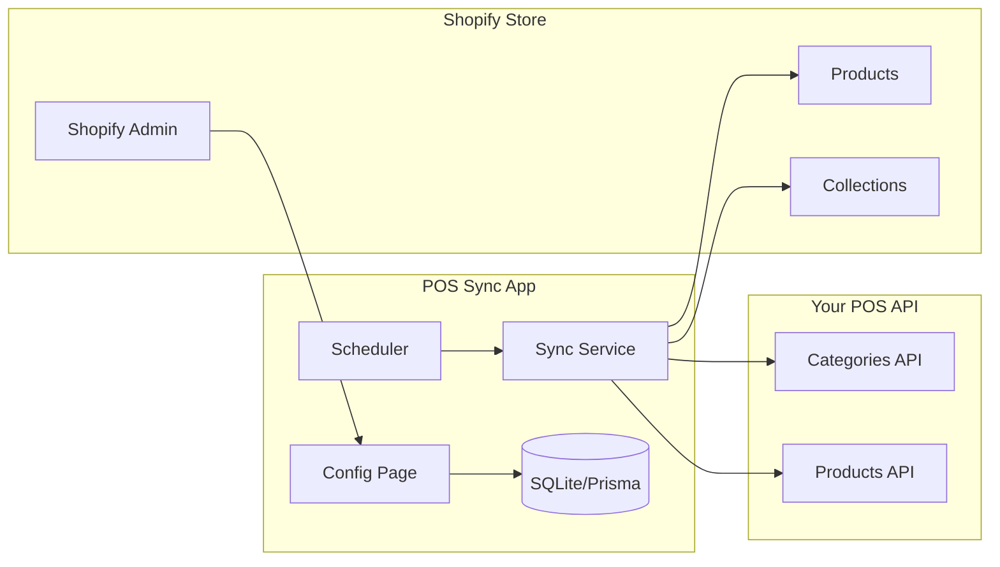

# POS Sync Shopify App

## Architecture Overview



## Tech Stack

- **Framework**: Node.js + Remix (Shopify CLI template)
- **Database**: SQLite with Prisma ORM (stores shop credentials)
- **Auth**: Shopify OAuth 2.0
- **Scheduler**: node-cron for background jobs
- **Encryption**: crypto-js for AES-256-CBC decryption

## Project Structure

```
shopify-pos-sync/
├── app/
│   ├── routes/
│   │   ├── app._index.tsx      # Dashboard
│   │   ├── app.settings.tsx    # API Configuration
│   │   ├── app.sync.tsx        # Manual sync trigger
│   │   └── app.logs.tsx        # Sync history
│   ├── services/
│   │   ├── pos-api.server.ts   # POS API client with decryption
│   │   ├── shopify-sync.server.ts  # Shopify sync logic
│   │   └── scheduler.server.ts # Cron jobs
│   └── models/
│       └── settings.server.ts  # Database operations
├── prisma/
│   └── schema.prisma           # Database schema
├── shopify.app.toml            # Shopify app config
└── package.json
```

## Key Features

### 1. Settings Page

- Base URL input (e.g., `http://37.34.237.190:9292/TheOneAPIPOS/api/`)
- Username & Password for Basic Auth
- Encryption Key (32 characters)
- IV (16 characters)
- Sync frequency selector (hourly/daily)
- Test connection button

### 2. Sync Service

- Fetches categories using `Category/GetMainCategory`
- Fetches subcategories using `Category/GetCategoryByParentId`
- Fetches products using `Product/Get` with pagination
- Decrypts AES-256-CBC encrypted responses
- Creates/updates Shopify Collections (for categories)
- Creates/updates Shopify Products with:
  - Title (Arabic/English)
  - Price
  - SKU (ProductCode)
  - Images
  - Assigns to correct collection

### 3. Scheduler

- Runs sync job based on configured frequency
- Logs sync results (success/failure count)
- Handles errors gracefully

## Database Schema (Prisma)

```prisma
model Shop {
  id            String   @id @default(uuid())
  shopDomain    String   @unique
  accessToken   String
  baseUrl       String?
  username      String?
  password      String?
  encryptionKey String?
  iv            String?
  syncFrequency String   @default("daily")
  lastSync      DateTime?
  createdAt     DateTime @default(now())
}

model SyncLog {
  id           String   @id @default(uuid())
  shopDomain   String
  status       String
  productsSync Int      @default(0)
  categoriesSync Int    @default(0)
  errors       String?
  createdAt    DateTime @default(now())
}
```

## Shopify App Scopes Required

- `read_products`, `write_products`
- `read_product_listings`, `write_product_listings`
- `read_inventory`, `write_inventory`

## Setup Steps

1. Create Shopify app using CLI
2. Configure app scopes and URLs
3. Implement settings page with form
4. Build POS API client with decryption
5. Build Shopify sync service
6. Add scheduler for automatic sync
7. Test with dev store
8. Deploy to hosting (Heroku/Railway/Render)